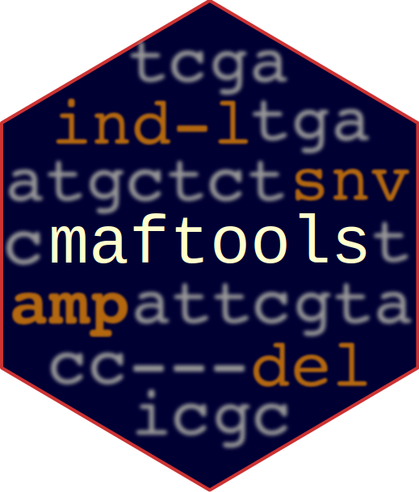

# Genotype cancer hotspots

`cancerhotspots` allows rapid genotyping of [known somatic hotspots](https://www.cancerhotspots.org/) from the tumor BAM files. This facilitates to get a quick overlook of 3,181 known somatic hot-spots in a matter of minutes, without spending hours on variant calling and annotation. In simple words, it fetches nucleotide frequencies of known somatic hotspots and prioritizes them based on allele frequency. 

Output includes a browsable HTML file with variants passing the VAF/read depth filters and, a TSV file including nucleotide counts of all variants analyzed.

* Example report from a [metastatic breast cancer](https://poisonalien.github.io/STAR_wrapper_script/) sample

```{r setup, message=FALSE, warning=FALSE}
library(maftools)
```

```{r, eval=FALSE}
can_hs_tbl = maftools::cancerhotspots(
  bam = "Tumor.bam",
  refbuild = "GRCh37",
  mapq = 10,
  sam_flag = 1024
)
```

```
Input BAM file           :  Tumor.bam
Variants                 :  cancerhotspots_v2_GRCh37.tsv
VAF filter               :  0.050
min reads for t_allele   :  8
MAPQ filter              :  10
FLAG filter              :  1024
Coverage filter          :  30
HTSlib version           :  1.7

Processed 1000 entries..
Processed 2000 entries..
Processed 3000 entries..
Done!

Summary:
Total variants processed :  3181
Variants > 0.05 threshold:  3
Avg. depth of coverage   :  83.02
Output html report       :  Tumor.html
Output TSV file          :  Tumor.tsv
```

Above command generates an [HTML report](https://poisonalien.github.io/STAR_wrapper_script/) and a TSV file with the readcounts.

```{r, eval=FALSE}
head(can_hs_tbl)

# loci fa_ref NT_change Hugo_Symbol Variant_Classification AA_change              Meta VAF A   T  G  C Ins Del
# 1: 1:2491289     NA       G>A    TNFRSF14      Missense_Mutation     C111Y    deleterious(0)   0 0   0 21  0   0   0
# 2: 1:2491290     NA       C>G    TNFRSF14      Missense_Mutation     C111W    deleterious(0)   0 0   0  0 21   0   0
# 3: 1:8073432     NA       T>G      ERRFI1      Missense_Mutation     K409N    deleterious(0)   0 1  64  0  1   0   0
# 4: 1:8073434     NA       T>G      ERRFI1      Missense_Mutation     K409Q deleterious(0.04)   0 0  63  0  0   0   0
# 5: 1:8074313     NA       T>A      ERRFI1      Nonsense_Mutation     K116*                     0 0 106  0  0   0   0
# 6: 1:9779982     NA       T>C      PIK3CD      Missense_Mutation     C416R   tolerated(0.26)   0 1  18  0  0   0   0
```


The tsv files generated by `cancerhotspots()` can be aggregated and converted into MAF with the function `cancerhotspotsAggr()`.

CLI version of `cancerhotspots` can be found [here](https://github.com/PoisonAlien/somaticfreq)


# Fetch readcounts for targetted loci

`bamreadcounts` function extracts ATGC nucleotide distribution for targeted loci from the BAM files. The function name is an homage to [bam-readcount](https://github.com/genome/bam-readcount) tool and additionally supports INDELS.

```{r}
#Generate a sample loci - first two columns must contain chromosome name and position 
loci = data.table::data.table(chr = c("seq1", "seq2"), pos = c(1340, 1483))
loci
```

Get nucleotide frequency from BAM files
```{r, eval=FALSE}
#Example BAM file from Rsamtools package
#By default position are assumed to be in 1-based coordinate system
bamfile = system.file("extdata", "ex1.bam", package = "Rsamtools") 
loci_rc = maftools::bamreadcounts(bam = bamfile, loci = loci) 

loci_rc
# $ex1
#         loci fa_ref A  T G  C Ins Del
# 1: seq1:1340     NA 1  0 0 62   0   0
# 2: seq2:1483     NA 0 13 0  0   0   0
```


```{r}
sessionInfo()
```

