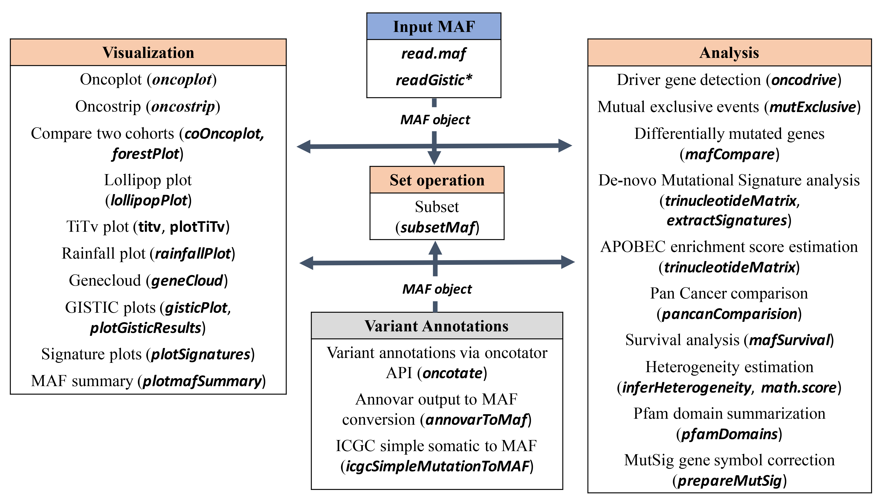

# Introduction

With advances in Cancer Genomics, [Mutation Annotation Format](https://docs.gdc.cancer.gov/Data/File_Formats/MAF_Format/) (MAF) is being widely accepted and used to store somatic variants detected. [The Cancer Genome Atlas](http://cancergenome.nih.gov) Project has sequenced over 30 different cancers with sample size of each cancer type being over 200. [Resulting data](https://wiki.nci.nih.gov/display/TCGA/TCGA+MAF+Files) consisting of somatic variants are stored in the form of [Mutation Annotation Format](https://docs.gdc.cancer.gov/Data/File_Formats/MAF_Format/). This package attempts to summarize, analyze, annotate and visualize MAF files in an efficient manner from either TCGA sources or any in-house studies as long as the data is in MAF format.

## Citation

If you find this tool useful, please cite:

------------------------------------------------------------------------

***Mayakonda A, Lin DC, Assenov Y, Plass C, Koeffler HP. 2018. Maftools: efficient and comprehensive analysis of somatic variants in cancer. [Genome ResarchPMID: 30341162](https://doi.org/10.1101/gr.239244.118)***

------------------------------------------------------------------------

# Generating MAF files

-   For VCF files or simple tabular files, easy option is to use [vcf2maf](https://github.com/mskcc/vcf2maf) utility which will annotate VCFs, prioritize transcripts, and generates an MAF. Recent updates to gatk has also enabled [funcotator](https://gatk.broadinstitute.org/hc/en-us/articles/360035889931-Funcotator-Information-and-Tutorial) to genrate MAF files.

-   If you're using [ANNOVAR](http://annovar.openbioinformatics.org/en/latest/) for variant annotations, maftools has a handy function `annovarToMaf` for converting tabular annovar outputs to MAF.

# MAF field requirements

MAF files contain many fields ranging from chromosome names to cosmic annotations. However most of the analysis in maftools uses following fields.

-   Mandatory fields: **Hugo_Symbol, Chromosome, Start_Position, End_Position, Reference_Allele, Tumor_Seq_Allele2, Variant_Classification, Variant_Type and Tumor_Sample_Barcode**.

-   Recommended optional fields: non MAF specific fields containing VAF (Variant Allele Frequecy) and amino acid change information.

Complete specification of MAF files can be found on [NCI GDC documentation page](https://docs.gdc.cancer.gov/Data/File_Formats/MAF_Format/).

This vignette demonstrates the usage and application of maftools on an example MAF file from TCGA LAML cohort [1](#references).

# Installation

```{r, eval=FALSE}
if (!require("BiocManager"))
    install.packages("BiocManager")
BiocManager::install("maftools")
```

# Overview of the package

maftools functions can be categorized into mainly Visualization and Analysis modules. Each of these functions and a short description is summarized as shown below. Usage is simple, just read your MAF file with `read.maf` (along with copy-number data if available) and pass the resulting MAF object to the desired function for plotting or analysis.



# Reading and summarizing maf files

## Required input files

-   an MAF file - can be gz compressed. Required.
-   an optional but recommended clinical data associated with each sample/Tumor_Sample_Barcode in MAF.
-   an optional copy number data if available. Can be GISTIC output or a custom table containing sample names, gene names and copy-number status (`Amp` or `Del`).

## Reading MAF files.

`read.maf` function reads MAF files, summarizes it in various ways and stores it as an MAF object. Even though MAF file is alone enough, it is recommended to provide annotations associated with samples in MAF. One can also integrate copy number data if available.

```{r results='hide', message=FALSE}
library(maftools)
```

```{r}
#path to TCGA LAML MAF file
laml.maf = system.file('extdata', 'tcga_laml.maf.gz', package = 'maftools') 
#clinical information containing survival information and histology. This is optional
laml.clin = system.file('extdata', 'tcga_laml_annot.tsv', package = 'maftools') 

laml = read.maf(maf = laml.maf, clinicalData = laml.clin)
```

## MAF object

Summarized MAF file is stored as an MAF object. MAF object contains main maf file, summarized data and any associated sample annotations.

There are accessor methods to access the useful slots from MAF object.

```{r}
#Typing laml shows basic summary of MAF file.
laml
```

```{r, eval=FALSE}
#Shows sample summry.
getSampleSummary(laml)
#Shows gene summary.
getGeneSummary(laml)
#shows clinical data associated with samples
getClinicalData(laml)
#Shows all fields in MAF
getFields(laml)
#Writes maf summary to an output file with basename laml.
write.mafSummary(maf = laml, basename = 'laml')
```

# Visualization

## Plotting MAF summary.

We can use `plotmafSummary` to plot the summary of the maf file, which displays number of variants in each sample as a stacked barplot and variant types as a boxplot summarized by Variant_Classification.

```{r,fig.height=4, fig.width=6}
plotmafSummary(maf = laml, rmOutlier = TRUE, addStat = 'median', dashboard = TRUE, titvRaw = FALSE)
```

Use `mafbarplot` for a minimal barplot of mutated genes.

## Oncoplots

### Drawing oncoplots

Better representation of maf file can be shown as oncoplots, also known as waterfall plots.

```{r, fig.align='left',fig.height=3.5,fig.width=6, fig.align='left'}
#oncoplot for top ten mutated genes.
oncoplot(maf = laml, top = 10)
```

NOTE: Variants annotated as `Multi_Hit` are those genes which are mutated more than once in the same sample.

For more details on customisation see the [Customizing oncoplots](http://bioconductor.org/packages/devel/bioc/vignettes/maftools/inst/doc/oncoplots.html) vignette.

## Transition and Transversions.

`titv` function classifies SNPs into [Transitions and Transversions](http://www.mun.ca/biology/scarr/Transitions_vs_Transversions.html) and returns a list of summarized tables in various ways. Summarized data can also be visualized as a boxplot showing overall distribution of six different conversions and as a stacked barplot showing fraction of conversions in each sample.

```{r, fig.height=3, fig.width=4.2, eval = T, fig.align='left'}
laml.titv = titv(maf = laml, plot = FALSE, useSyn = TRUE)
#plot titv summary
plotTiTv(res = laml.titv)
```

## Lollipop plots for amino acid changes

`lollipopPlot` function requires us to have amino acid changes information in the maf file. However MAF files have no clear guidelines on naming the field for amino acid changes, with different studies having different field (or column) names for amino acid changes. By default, `lollipopPlot` looks for column `AAChange`, and if its not found in the MAF file, it prints all available fields with a warning message. For below example, MAF file contains amino acid changes under a field/column name 'Protein_Change'. We will manually specify this using argument `AACol`.

By default lollipopPlot uses the longest isoform of the gene.

```{r,fig.align='left', fig.width=4.5, fig.height=2.5}
#lollipop plot for DNMT3A, which is one of the most frequent mutated gene in Leukemia.
lollipopPlot(
  maf = laml,
  gene = 'DNMT3A',
  AACol = 'Protein_Change',
  showMutationRate = TRUE,
  labelPos = 882
)
```

General protein domains can be drawn with the function `plotProtein`

```{r,fig.align='left', fig.width=5, fig.height=1.2}
plotProtein(gene = "TP53", refSeqID = "NM_000546")
```

## Rainfall plots

Cancer genomes, especially solid tumors are characterized by genomic loci with localized hyper-mutations [5](#references). Such hyper mutated genomic regions can be visualized by plotting inter variant distance on a linear genomic scale. These plots generally called rainfall plots and we can draw such plots using `rainfallPlot`. If `detectChangePoints` is set to TRUE, `rainfall` plot also highlights regions where potential changes in inter-event distances are located.

```{r, results='hide', message=FALSE}
brca <- system.file("extdata", "brca.maf.gz", package = "maftools")
brca = read.maf(maf = brca, verbose = FALSE)
```

```{r, fig.height=3,fig.width=6,fig.align='left'}
rainfallPlot(maf = brca, detectChangePoints = TRUE, pointSize = 0.4)
```

"Kataegis" are defined as those genomic segments containing six or more consecutive mutations with an average inter-mutation distance of less than or equal to 1,00 bp [5](#references).

## Compare mutation load against TCGA cohorts

`tcgaCompare` uses mutation load from TCGA [MC3](https://gdc.cancer.gov/about-data/publications/mc3-2017) for comparing muttaion burden against 33 TCGA cohorts. Plot generated is [similar](http://www.nature.com/nature/journal/v500/n7463/fig_tab/nature12477_F1.html) to the one described in Alexandrov et al [5](#references).

```{r, fig.align='left', fig.height=3.25, fig.width=6, message=FALSE, results='hide'}
laml.mutload = tcgaCompare(maf = laml, cohortName = 'Example-LAML', logscale = TRUE, capture_size = 50)
```

## Plotting VAF

This function plots Variant Allele Frequencies as a boxplot which quickly helps to estimate clonal status of top mutated genes (clonal genes usually have mean allele frequency around \~50% assuming pure sample)

```{r, fig.align='left', fig.height=3, fig.width=3}
plotVaf(maf = laml, vafCol = 'i_TumorVAF_WU')
```

# Processing copy-number data

## Reading and summarizing gistic output files.

We can summarize output files generated by GISTIC programme. As mentioned earlier, we need four files that are generated by GISTIC, i.e, all_lesions.conf_XX.txt, amp_genes.conf_XX.txt, del_genes.conf_XX.txt and scores.gistic, where XX is the confidence level. See [GISTIC documentation](ftp://ftp.broadinstitute.org/pub/GISTIC2.0/GISTICDocumentation_standalone.htm) for details.

```{r}
all.lesions <- system.file("extdata", "all_lesions.conf_99.txt", package = "maftools")
amp.genes <- system.file("extdata", "amp_genes.conf_99.txt", package = "maftools")
del.genes <- system.file("extdata", "del_genes.conf_99.txt", package = "maftools")
scores.gis <- system.file("extdata", "scores.gistic", package = "maftools")

laml.gistic = readGistic(gisticAllLesionsFile = all.lesions, gisticAmpGenesFile = amp.genes, gisticDelGenesFile = del.genes, gisticScoresFile = scores.gis, isTCGA = TRUE)

#GISTIC object
laml.gistic
```

Similar to MAF objects, there are methods available to access slots of GISTIC object - `getSampleSummary`, `getGeneSummary` and `getCytoBandSummary`. Summarized results can be written to output files using function `write.GisticSummary`.

## Visualizing gistic results.

There are three types of plots available to visualize gistic results.

### genome plot

```{r, fig.width=4, fig.height=3, fig.align='left'}
gisticChromPlot(gistic = laml.gistic, markBands = "all")
```

### Bubble plot

```{r, fig.width=4, fig.height=3, fig.align='left'}
gisticBubblePlot(gistic = laml.gistic)
```

### oncoplot

This is similar to oncoplots except for copy number data. One can again sort the matrix according to annotations, if any. Below plot is the gistic results for LAML, sorted according to FAB classification. Plot shows that 7q deletions are virtually absent in M4 subtype where as it is widespread in other subtypes.

```{r, fig.align='left',fig.width=5, fig.height=3, eval=T}
gisticOncoPlot(gistic = laml.gistic, clinicalData = getClinicalData(x = laml), clinicalFeatures = 'FAB_classification', sortByAnnotation = TRUE, top = 10)
```

### Visualizing CBS segments

```{r, fig.height=2.5,fig.width=4,fig.align='left'}
tcga.ab.009.seg <- system.file("extdata", "TCGA.AB.3009.hg19.seg.txt", package = "maftools")
plotCBSsegments(cbsFile = tcga.ab.009.seg)
```

# Analysis

## Somatic Interactions

Mutually exclusive or co-occurring set of genes can be detected using `somaticInteractions` function, which performs pair-wise Fisher's Exact test to detect such significant pair of genes.

```{r, message=FALSE, fig.height=5, fig.width=5}
#exclusive/co-occurance event analysis on top 10 mutated genes. 
somaticInteractions(maf = laml, top = 25, pvalue = c(0.05, 0.1))
```

## Detecting cancer driver genes based on positional clustering

maftools has a function `oncodrive` which identifies cancer genes (driver) from a given MAF. `oncodrive` is a based on algorithm [oncodriveCLUST](http://bg.upf.edu/group/projects/oncodrive-clust.php) which was originally implemented in Python. Concept is based on the fact that most of the variants in cancer causing genes are enriched at few specific loci (aka hot-spots). This method takes advantage of such positions to identify cancer genes. If you use this function, please cite [OncodriveCLUST article](http://bioinformatics.oxfordjournals.org/content/early/2013/07/31/bioinformatics.btt395.full) [7](#references).

```{r, fig.align='default', fig.width=7,fig.height=5, message=F,results='hide', eval=T}
laml.sig = oncodrive(maf = laml, AACol = 'Protein_Change', minMut = 5, pvalMethod = 'zscore')
```

```{r}
head(laml.sig)
```

We can plot the results using `plotOncodrive`.

```{r, fig.align='left', fig.width=3.2, fig.height=3.2}
plotOncodrive(res = laml.sig, fdrCutOff = 0.1, useFraction = TRUE, labelSize = 0.5)
```

`plotOncodrive` plots the results as scatter plot with size of the points proportional to the number of clusters found in the gene. X-axis shows number of mutations (or fraction of mutations) observed in these clusters. In the above example, IDH1 has a single cluster and all of the 18 mutations are accumulated within that cluster, giving it a cluster score of one. For details on oncodrive algorithm, please refer to [OncodriveCLUST article](http://bioinformatics.oxfordjournals.org/content/early/2013/07/31/bioinformatics.btt395.full) [7](#references).

## Adding and summarizing pfam domains

maftools comes with the function `pfamDomains`, which adds pfam domain information to the amino acid changes. `pfamDomain` also summarizes amino acid changes according to the domains that are affected. This serves the purpose of knowing what domain in given cancer cohort, is most frequently affected. This function is inspired from Pfam annotation module from MuSic tool [8](#references).

```{r, fig.align='left', fig.width=4, fig.height=3}
laml.pfam = pfamDomains(maf = laml, AACol = 'Protein_Change', top = 10)
#Protein summary (Printing first 7 columns for display convenience)
laml.pfam$proteinSummary[,1:7, with = FALSE]
#Domain summary (Printing first 3 columns for display convenience)
laml.pfam$domainSummary[,1:3, with = FALSE]
```

## Survival analysis

Survival analysis is an essential part of cohort based sequencing projects. Function `mafSurvive` performs survival analysis and draws kaplan meier curve by grouping samples based on mutation status of user defined gene(s) or manually provided samples those make up a group. This function requires input data to contain Tumor_Sample_Barcode (make sure they match to those in MAF file), binary event (1/0) and time to event.

Our annotation data already contains survival information and in case you have survival data stored in a separate table provide them via argument `clinicalData`

### Mutation in any given genes

```{r, fig.width=3, fig.height=3}
#Survival analysis based on grouping of DNMT3A mutation status
mafSurvival(maf = laml, genes = 'DNMT3A', time = 'days_to_last_followup', Status = 'Overall_Survival_Status', isTCGA = TRUE)
```

### Predict genesets associated with survival

Identify set of genes which results in poor survival

```{r}
#Using top 20 mutated genes to identify a set of genes (of size 2) to predict poor prognostic groups
prog_geneset = survGroup(maf = laml, top = 20, geneSetSize = 2, time = "days_to_last_followup", Status = "Overall_Survival_Status", verbose = FALSE)

print(prog_geneset)
```

Above results show a combination (N = 2) of genes which are associated with poor survival (P \< 0.05). We can draw KM curve for above results with the function `mafSurvGroup`

```{r, fig.width=3, fig.height=3}
mafSurvGroup(maf = laml, geneSet = c("DNMT3A", "FLT3"), time = "days_to_last_followup", Status = "Overall_Survival_Status")
```

## Comparing two cohorts (MAFs)

Cancers differ from each other in terms of their mutation pattern. We can compare two different cohorts to detect such differentially mutated genes. For example, recent article by [Madan et. al](http://www.ncbi.nlm.nih.gov/pubmed/27063598) [9](references), have shown that patients with relapsed APL (Acute Promyelocytic Leukemia) tends to have mutations in PML and RARA genes, which were absent during primary stage of the disease. This difference between two cohorts (in this case primary and relapse APL) can be detected using function `mafComapre`, which performs fisher test on all genes between two cohorts to detect differentially mutated genes.

```{r results='hide', message=FALSE}
#Primary APL MAF
primary.apl = system.file("extdata", "APL_primary.maf.gz", package = "maftools")
primary.apl = read.maf(maf = primary.apl)
#Relapse APL MAF
relapse.apl = system.file("extdata", "APL_relapse.maf.gz", package = "maftools")
relapse.apl = read.maf(maf = relapse.apl)
```

```{r, fig.align='left'}
#Considering only genes which are mutated in at-least in 5 samples in one of the cohort to avoid bias due to genes mutated in single sample.
pt.vs.rt <- mafCompare(m1 = primary.apl, m2 = relapse.apl, m1Name = 'Primary', m2Name = 'Relapse', minMut = 5)
print(pt.vs.rt)
```

### Forest plots

Above results show two genes PML and RARA which are highly mutated in Relapse APL compared to Primary APL. We can visualize these results as a [forestplot](https://en.wikipedia.org/wiki/Forest_plot).

```{r, fig.width=6, fig.height=4.5, fig.align='left'}
forestPlot(mafCompareRes = pt.vs.rt, pVal = 0.1)
```

### Co-onco plots

Another alternative way of displaying above results is by plotting two oncoplots side by side. `coOncoplot` function takes two maf objects and plots them side by side for better comparison.

```{r, fig.height=2.5,fig.width=6, eval=T, fig.align='left'}
genes = c("PML", "RARA", "RUNX1", "ARID1B", "FLT3")
coOncoplot(m1 = primary.apl, m2 = relapse.apl, m1Name = 'PrimaryAPL', m2Name = 'RelapseAPL', genes = genes, removeNonMutated = TRUE)
```

### Co-bar plots

```{r, fig.height=3, fig.width=4}
coBarplot(m1 = primary.apl, m2 = relapse.apl, m1Name = "Primary", m2Name = "Relapse")
```

### Lollipop plot-2

Along with plots showing cohort wise differences, its also possible to show gene wise differences with `lollipopPlot2` function.

```{r, warning=FALSE, message=FALSE,fig.align='left', results='hide', fig.height=3.5, fig.width=5}
lollipopPlot2(m1 = primary.apl, m2 = relapse.apl, gene = "PML", AACol1 = "amino_acid_change", AACol2 = "amino_acid_change", m1_name = "Primary", m2_name = "Relapse")
```

## Clinical enrichment analysis

`clinicalEnrichment` is another function which takes any clinical feature associated with the samples and performs enrichment analysis. It performs various groupwise and pairwise comparisions to identify enriched mutations for every category within a clincila feature. Below is an example to identify mutations associated with FAB_classification.

```{r}
fab.ce = clinicalEnrichment(maf = laml, clinicalFeature = 'FAB_classification')

#Results are returned as a list. Significant associations p-value < 0.05
fab.ce$groupwise_comparision[p_value < 0.05]
```

Above results shows IDH1 mutations are enriched in M1 subtype of leukemia compared to rest of the cohort. Similarly DNMT3A is in M5, RUNX1 is in M0, and so on. These are well known results and this function effectively recaptures them. One can use any sort of clincial feature to perform such an analysis. There is also a small function - `plotEnrichmentResults` which can be used to plot these results.

```{r, fig.width=4, fig.height=3}
plotEnrichmentResults(enrich_res = fab.ce, pVal = 0.05, geneFontSize = 0.5, annoFontSize = 0.6)
```

## Drug-Gene Interactions

`drugInteractions` function checks for drug--gene interactions and gene druggability information compiled from [Drug Gene Interaction database](http://www.dgidb.org).

```{r, fig.height=3, fig.width=5}
dgi = drugInteractions(maf = laml, fontSize = 0.75)
```

Above plot shows potential druggable gene categories along with upto top 5 genes involved in them. One can also extract information on drug-gene interactions. For example below is the results for known/reported drugs to interact with DNMT3A.

```{r}
dnmt3a.dgi = drugInteractions(genes = "DNMT3A", drugs = TRUE)
#Printing selected columns.
dnmt3a.dgi[,.(Gene, interaction_types, drug_name, drug_claim_name)]
```

Please cite [DGIdb article](https://www.ncbi.nlm.nih.gov/entrez/eutils/elink.fcgi?dbfrom=pubmed&retmode=ref&cmd=prlinks&id=24122041) if you find this function useful [10](#references).

*Disclaimer: Resources used in this function are intended for purely research purposes. It should not be used for emergencies or medical or professional advice.*

## Oncogenic Signaling Pathways

`OncogenicPathways` function checks for enrichment of known Oncogenic Signaling Pathways in TCGA cohorts [11](#references).

```{r, fig.width=3.5, fig.height=3}
OncogenicPathways(maf = laml)
```

Its also possible to visualize complete pathway.

```{r, fig.width=6, fig.height=2.5}
PlotOncogenicPathways(maf = laml, pathways = "RTK-RAS")
```

Tumor suppressor genes are in red, and oncogenes are in blue font.

## Tumor heterogeneity and MATH scores

### Heterogeneity in tumor samples

Tumors are generally heterogeneous i.e, consist of multiple clones. This heterogeneity can be inferred by clustering variant allele frequencies. `inferHeterogeneity` function uses vaf information to cluster variants (using `mclust`), to infer clonality. By default, `inferHeterogeneity` function looks for column *t_vaf* containing vaf information. However, if the field name is different from *t_vaf*, we can manually specify it using argument `vafCol`. For example, in this case study vaf is stored under the field name *i_TumorVAF_WU*.

```{r, echo = TRUE, fig.align='left', fig.height=3.5, fig.width=4, eval=T}
#Heterogeneity in sample TCGA.AB.2972
library("mclust")
tcga.ab.2972.het = inferHeterogeneity(maf = laml, tsb = 'TCGA-AB-2972', vafCol = 'i_TumorVAF_WU')
print(tcga.ab.2972.het$clusterMeans)
#Visualizing results
plotClusters(clusters = tcga.ab.2972.het)
```

Above figure shows clear separation of two clones clustered at mean variant allele frequencies of \~45% (major clone) and another minor clone at variant allele frequency of \~25%.

Although clustering of variant allele frequencies gives us a fair idea on heterogeneity, it is also possible to measure the extent of heterogeneity in terms of a numerical value. MATH score (mentioned as a subtitle in above plot) is a simple quantitative measure of intra-tumor heterogeneity, which calculates the width of the vaf distribution. Higher MATH scores are found to be associated with poor outcome. MATH score can also be used a proxy variable for survival analysis [11](#references).

### Ignoring variants in copy number altered regions

We can use copy number information to ignore variants located on copy-number altered regions. Copy number alterations results in abnormally high/low variant allele frequencies, which tends to affect clustering. Removing such variants improves clustering and density estimation while retaining biologically meaningful results. Copy number information can be provided as a segmented file generated from segmentation programmes, such as Circular Binary Segmentation from "DNACopy" Bioconductor package [6](#references).

```{r, fig.align='left', fig.height=3.5, fig.width=4, eval=T}
seg = system.file('extdata', 'TCGA.AB.3009.hg19.seg.txt', package = 'maftools')
tcga.ab.3009.het = inferHeterogeneity(maf = laml, tsb = 'TCGA-AB-3009', segFile = seg, vafCol = 'i_TumorVAF_WU')
#Visualizing results. Highlighting those variants on copynumber altered variants.
plotClusters(clusters = tcga.ab.3009.het, genes = 'CN_altered', showCNvars = TRUE)
```

Above figure shows two genes NF1 and SUZ12 with high VAF's, which is due to copy number alterations (deletion). Those two genes are ignored from analysis.

## Mutational Signatures

Every cancer, as it progresses leaves a signature characterized by specific pattern of nucleotide substitutions. [Alexandrov et.al](http://www.nature.com/nature/journal/v500/n7463/full/nature12477.html) have shown such mutational signatures, derived from over 7000 cancer samples [5](#references). Such signatures can be extracted by decomposing matrix of nucleotide substitutions, classified into 96 substitution classes based on immediate bases surrounding the mutated base. Extracted signatures can also be compared to those [validated signatures](http://cancer.sanger.ac.uk/cosmic/signatures).

First step in signature analysis is to obtain the adjacent bases surrounding the mutated base and form a mutation matrix. NOTE: Earlier versions of maftools required a fasta file as an input. But starting from 1.8.0, BSgenome objects are used for faster sequence extraction.

```{r, eval=TRUE}
#Requires BSgenome object
library("BSgenome.Hsapiens.UCSC.hg19", quietly = TRUE)
laml.tnm = trinucleotideMatrix(maf = laml, prefix = 'chr', add = TRUE, ref_genome = "BSgenome.Hsapiens.UCSC.hg19")
```

Above function performs two steps:

-   Estimates APOBEC enrichment scores
-   Prepares a mutational matrix for signature analysis.

### APOBEC Enrichment estimation.

APOBEC induced mutations are more frequent in solid tumors and are mainly associated with C\>T transition events occurring in TCW motif. APOBEC enrichment scores in the above command are estimated using the method described by Roberts et al [13](#references). Briefly, enrichment of C\>T mutations occurring within TCW motif over all of the C\>T mutations in a given sample is compared to background Cytosines and TCWs occurring within 20bp of mutated bases.

$$\frac{n_{tCw} * background_C}{n_C * background_{TCW}}$$

One-sided fishers exact test is also performed to statistically evaluate the enrichment score, as described in original study by Roberts et al.

### Differences between APOBEC enriched and non-enriched samples

We can also analyze the differences in mutational patterns between APOBEC enriched and non-APOBEC enriched samples. `plotApobecDiff` is a function which takes APOBEC enrichment scores estimated by `trinucleotideMatrix` and classifies samples into APOBEC enriched and non-APOBEC enriched. Once stratified, it compares these two groups to identify differentially altered genes.

Note that, LAML with no APOBEC enrichments, is not an ideal cohort for this sort of analysis and hence below plot is only for demonstration purpose.

```{r, eval=TRUE, fig.height=3, fig.width=5}
plotApobecDiff(tnm = laml.tnm, maf = laml, pVal = 0.2)
```

### Signature analysis

Signature analysis includes following steps.

1.  `estimateSignatures` - which runs NMF on a range of values and measures the goodness of fit - in terms of [Cophenetic correlation](https://en.wikipedia.org/wiki/Cophenetic_correlation).
2.  `plotCophenetic` - which draws an elblow plot and helps you to decide optimal number of signatures. Best possible signature is the value at which Cophenetic correlation drops significantly.
3.  `extractSignatures` - uses non-negative matrix factorization to decompose the matrix into `n` signatures. `n` is chosen based on the above two steps. In case if you already have a good estimate of `n`, you can skip above two steps.
4.  `compareSignatures` - extracted signatures from above step can be compared to known signatures[11](#references) from [COSMIC](https://cancer.sanger.ac.uk/cosmic/signatures/SBS/) database, and cosine similarity is calculated to identify best match.
5.  `plotSignatures` - plots signatures

```{r, echo=FALSE}
par(mar = c(2, 2, 2, 1))
plot(NA, xlim = c(1, 10), ylim = c(0, 30), frame.plot = FALSE, axes = FALSE, xlab = NA, ylab = NA)
rect(xleft = 3, ybottom = 28, xright = 7, ytop = 30, col = grDevices::adjustcolor("gray70", alpha.f = 0.6), lwd = 1.2, border = "maroon")
text(x = 5, y = 29, labels = "MAF", font = 2)
arrows(x0 = 5, y0 = 28, x1 = 5, y1 = 26, length = 0.1, lwd = 2)
text(x = 5, y = 25, labels = "trinucleotideMatrix()", font = 3)
arrows(x0 = 5, y0 = 24, x1 = 5, y1 = 21, length = 0.1, lwd = 2)
text(x = 5, y = 20, labels = "estimateSignatures()", font = 3)
arrows(x0 = 5, y0 = 19, x1 = 5, y1 = 16, length = 0.1, lwd = 2)
text(x = 5, y = 15, labels = "plotCophenetic()", font = 3)
arrows(x0 = 5, y0 = 14, x1 = 5, y1 = 11, length = 0.1, lwd = 2)
text(x = 5, y = 10, labels = "extractSignatures()", font = 3)
arrows(x0 = 5, y0 = 9, x1 = 5, y1 = 6, length = 0.1, lwd = 2)
text(x = 5, y = 5, labels = "compareSignatures()", font = 3)
arrows(x0 = 5, y0 = 4, x1 = 5, y1 = 1, length = 0.1, lwd = 2)
text(x = 5, y = 0, labels = "plotSignatures()", font = 3)
```

***Note:*** In previous versions, `extractSignatures` used to take care of above steps automatically. After versions 2.2.0, main function is split inot above 5 stpes for user flexibility.

```{r, fig.height=5, fig.width=5, eval=FALSE, message=FALSE}
library('NMF')
laml.sign = estimateSignatures(mat = laml.tnm, nTry = 6)
```

```{r, fig.height=3, fig.width=3, eval=TRUE, message=FALSE, echo=FALSE, include=FALSE}
#Run main function with maximum 6 signatures. 
library('NMF')
laml.sign = estimateSignatures(mat = laml.tnm, nTry = 6, pConstant = 0.1, plotBestFitRes = FALSE, parallel = 2)
```

Draw elbow plot to visualize and decide optimal number of signatures from above results.

```{r, fig.width=3, fig.height=3, eval=TRUE}
plotCophenetic(res = laml.sign)
```

Best possible value is the one at which the correlation value on the y-axis drops significantly. In this case it appears to be at `n = 3`. LAML is not an ideal example for signature analysis with its low mutation rate, but for solid tumors with higher mutation burden one could expect more signatures, provided sufficient number of samples.

Once `n` is estimated, we can run the main function.

```{r, eval=FALSE}
laml.sig = extractSignatures(mat = laml.tnm, n = 3)
```

```{r, eval=TRUE, echo=FALSE}
laml.sig = extractSignatures(mat = laml.tnm, n = 3, pConstant = 0.1,  parallel = 2)
```

Compare detected signatures to COSMIC [Legacy](https://cancer.sanger.ac.uk/cosmic/signatures_v2) or [SBS](https://cancer.sanger.ac.uk/cosmic/signatures_v2) signature database.

```{r, eval=TRUE}
#Compate against original 30 signatures 
laml.og30.cosm = compareSignatures(nmfRes = laml.sig, sig_db = "legacy")
#Compate against updated version3 60 signatures 
laml.v3.cosm = compareSignatures(nmfRes = laml.sig, sig_db = "SBS")
```

`compareSignatures` returns full table of cosine similarities against COSMIC signatures, which can be further analysed. Below plot shows comparison of similarities of detected signatures against validated signatures.

```{r, fig.width=7, fig.height=2.5, fig.align='center', eval=TRUE}
library('pheatmap')
pheatmap::pheatmap(mat = laml.og30.cosm$cosine_similarities, cluster_rows = FALSE, main = "cosine similarity against validated signatures")
```

Finally plot signatures

```{r, fig.width=6, fig.height=4, fig.align='center', eval = TRUE}
maftools::plotSignatures(nmfRes = laml.sig, title_size = 1.2, sig_db = "SBS")
```

If you fancy 3D barpots, you can install `barplot3d` package and visualize the results with `legoplot3d` function.

```{r, eval=FALSE}
library("barplot3d")
#Visualize first signature
sig1 = laml.sig$signatures[,1]
barplot3d::legoplot3d(contextdata = sig1, labels = FALSE, scalexy = 0.01, sixcolors = "sanger", alpha = 0.5)
```

***NOTE:***

1.  Should you receive an error while running `extractSignatures` complaining `none of the packages are loaded`, please manually load the `NMF` library and re-run.

2.  If either `extractSignatures` or `estimateSignatures` stops in between, its possibly due to low mutation counts in the matrix. In that case rerun the functions with `pConstant` argument set to small positive value (e.g, 0.1).

# Variant Annotations

## Converting annovar output to MAF

Annovar is one of the most widely used Variant Annotation tool in Genomics [17](#references). Annovar output is generally in a tabular format with various annotation columns. This function converts such annovar output files into MAF. This function requires that annovar was run with gene based annotation as a first operation, before including any filter or region based annotations.

e.g,

```{r, engine='perl', eval=FALSE}
table_annovar.pl example/ex1.avinput humandb/ -buildver hg19 -out myanno -remove -protocol (refGene),cytoBand,dbnsfp30a -operation (g),r,f -nastring NA
```

`annovarToMaf` mainly uses gene based annotations for processing, rest of the annotation columns from input file will be attached to the end of the resulting MAF.

As an example we will annotate the same file which was used above to run `oncotate` function. We will annotate it using annovar with the following command. For simplicity, here we are including only gene based annotations but one can include as many annotations as they wish. But make sure the fist operation is always gene based annotation.

```{bash, eval = F}
$perl table_annovar.pl variants.tsv ~/path/to/humandb/ -buildver hg19 
-out variants --otherinfo -remove -protocol ensGene -operation g -nastring NA
```

Output generated is stored as a part of this package. We can convert this annovar output into MAF using `annovarToMaf`.

```{r, eval=T}
var.annovar = system.file("extdata", "variants.hg19_multianno.txt", package = "maftools")
var.annovar.maf = annovarToMaf(annovar = var.annovar, Center = 'CSI-NUS', refBuild = 'hg19', 
                               tsbCol = 'Tumor_Sample_Barcode', table = 'ensGene')

```

Annovar, when used with Ensemble as a gene annotation source, uses ensemble gene IDs as Gene names. In that case, use `annovarToMaf` with argument `table` set to `ensGene` which converts ensemble gene IDs into HGNC symbols.

## Converting ICGC Simple Somatic Mutation Format to MAF

Just like TCGA, International Cancer Genome Consortium [ICGC](http://icgc.org) also makes its data publicly available. But the data are stored in [Simpale Somatic Mutation Format](http://docs.icgc.org/submission/guide/icgc-simple-somatic-mutation-format/), which is similar to MAF format in its structure. However field names and classification of variants is different from that of MAF. `icgcSimpleMutationToMAF` is a function which reads ICGC data and converts them to MAF.

```{r}
#Read sample ICGC data for ESCA
esca.icgc <- system.file("extdata", "simple_somatic_mutation.open.ESCA-CN.sample.tsv.gz", package = "maftools")
esca.maf <- icgcSimpleMutationToMAF(icgc = esca.icgc, addHugoSymbol = TRUE)
#Printing first 16 columns for display convenience.
print(esca.maf[1:5,1:16, with = FALSE])
```

Note that by default Simple Somatic Mutation format contains all affected transcripts of a variant resulting in multiple entries of the same variant in same sample. It is hard to choose a single affected transcript based on annotations alone and by default this program removes repeated variants as duplicated entries. If you wish to keep all of them, set `removeDuplicatedVariants` to FALSE. Another option is to convert input file to MAF by removing duplicates and then use scripts like [vcf2maf](https://github.com/mskcc/vcf2maf) to re-annotate and prioritize affected transcripts.

## Prepare MAF file for MutSigCV analysis

MutSig/MutSigCV is most widely used program for detecting driver genes [18](#references). However, we have observed that covariates files (gene.covariates.txt and exome_full192.coverage.txt) which are bundled with MutSig have non-standard gene names (non Hugo_Symbols). This discrepancy between Hugo_Symbols in MAF and non-Hugo_symbols in covariates file causes MutSig program to ignore such genes. For example, KMT2D - a well known driver gene in Esophageal Carcinoma is represented as MLL2 in MutSig covariates. This causes KMT2D to be ignored from analysis and is represented as an insignificant gene in MutSig results. This function attempts to correct such gene symbols with a manually curated list of gene names compatible with MutSig covariates list.

```{r, eval=FALSE}
laml.mutsig.corrected = prepareMutSig(maf = laml)
# Converting gene names for 1 variants from 1 genes
#    Hugo_Symbol MutSig_Synonym N
# 1:    ARHGAP35          GRLF1 1
# Original symbols are preserved under column OG_Hugo_Symbol.
```

# Set operations

## Subsetting MAF

We can also subset MAF using function `subsetMaf`

```{r}
#Extract data for samples 'TCGA.AB.3009' and 'TCGA.AB.2933'  (Printing just 5 rows for display convenience)
subsetMaf(maf = laml, tsb = c('TCGA-AB-3009', 'TCGA-AB-2933'), mafObj = FALSE)[1:5]
##Same as above but return output as an MAF object (Default behaviour)
subsetMaf(maf = laml, tsb = c('TCGA-AB-3009', 'TCGA-AB-2933'))
```

### Specifying queries and controlling output fields.

```{r}
#Select all Splice_Site mutations from DNMT3A and NPM1
subsetMaf(maf = laml, genes = c('DNMT3A', 'NPM1'), mafObj = FALSE,query = "Variant_Classification == 'Splice_Site'")

#Same as above but include only 'i_transcript_name' column in the output
subsetMaf(maf = laml, genes = c('DNMT3A', 'NPM1'), mafObj = FALSE, query = "Variant_Classification == 'Splice_Site'", fields = 'i_transcript_name')
```

### Subsetting by clinical data

Use `clinQuery` argument in `subsetMaf` to select samples of interest based on their clinical features.

```{r}
#Select all samples with FAB clasification M4 in clinical data 
laml_m4 = subsetMaf(maf = laml, clinQuery = "FAB_classification %in% 'M4'")
```

# TCGA cohorts

Analysis of TCGA cohorts with `maftools` is as easy as it can get. This is made possible by processing TCGA MAF files from [Broad firehose](https://gdac.broadinstitute.org/) and TCGA [MC3](https://gdc.cancer.gov/about-data/publications/mc3-2017) project. Every cohort is stored as an MAF object containing somatic mutations (no CNVs) along with the relevant clinical information. There are two functions

* `tcgaAvailable()` will display available cohorts
* `tcgaLoad()` will load the desired cohort

## Available cohorts

```{r}
tcga_avail = tcgaAvailable()
head(tcga_avail, 3)
```

## Loading a TCGA cohort

```{r}
# By default MAF from MC3 project will be loaded
laml_mc3 = tcgaLoad(study = "LAML")
laml_mc3

# Change the source to Firehose
laml_fh = tcgaLoad(study = "LAML", source = "Firehose")
laml_fh
```


There is also an R data package containing the same pre-compiled TCGA MAF objects. Due to Bioconductor package size limits and other difficulties, this was not submitted to Bioconductor. However, you can still download [TCGAmutations](https://github.com/PoisonAlien/TCGAmutations) package from GitHub.

```{r, eval=FALSE}
BiocManager::install(pkgs = "PoisonAlien/TCGAmutations")
```

# MultiAssayExperiment

MAF can be converted to an object of class [MultiAssayExperiment](https://www.bioconductor.org/packages/release/bioc/html/MultiAssayExperiment.html) which facilitates integration of MAF with distinct data types. More information on `MultiAssayExperiment` can be found on the corresponding Bioconductor [landing page](https://www.bioconductor.org/packages/release/bioc/html/MultiAssayExperiment.html).

Note: Converting MAF to MAE object requires installation of [MultiAssayExperiment](https://www.bioconductor.org/packages/release/bioc/html/MultiAssayExperiment.html) and [RaggedExperiment](https://www.bioconductor.org/packages/release/bioc/html/RaggedExperiment.html) packages.

```{r}
laml_mae = maf2mae(m = laml)
laml_mae
```


# Useful links and tools

+--------------------------------------------------------------------------------------------------------------------+-------------------------------------------------------------------------------------------------+-----------------------------------------------------------------------------------------------+
| File formats                                                                                                       | Data Portals                                                                                    | Annotation tools                                                                              |
+:==================================================================================================================:+:===============================================================================================:+:=============================================================================================:+
| [Mutation Annotation Format](https://docs.gdc.cancer.gov/Data/File_Formats/MAF_Format/)                            | [TCGA](http://cancergenome.nih.gov)                                                             | [vcf2maf](https://github.com/mskcc/vcf2maf) - for converting your VCF files to MAF            |
+--------------------------------------------------------------------------------------------------------------------+-------------------------------------------------------------------------------------------------+-----------------------------------------------------------------------------------------------+
| [Variant Call Format](https://en.wikipedia.org/wiki/Variant_Call_Format)                                           | [ICGC](https://docs.icgc.org/)                                                                  | Ensembl Variant Effect Predictor [VEP](http://www.ensembl.org/info/docs/tools/vep/index.html) |
+--------------------------------------------------------------------------------------------------------------------+-------------------------------------------------------------------------------------------------+-----------------------------------------------------------------------------------------------+
| ICGC [Simple Somatic Mutation Format](https://docs.icgc.org/submission/guide/icgc-simple-somatic-mutation-format/) | [Broad Firehose](https://gdac.broadinstitute.org/)                                              | [Annovar](https://doc-openbio.readthedocs.io/projects/annovar/en/latest/)                     |
+--------------------------------------------------------------------------------------------------------------------+-------------------------------------------------------------------------------------------------+-----------------------------------------------------------------------------------------------+
|                                                                                                                    | [cBioPortal](https://www.cbioportal.org/)                                                       | [Funcotator](https://gatk.broadinstitute.org/hc/en-us/articles/360037224432-Funcotator)       |
+--------------------------------------------------------------------------------------------------------------------+-------------------------------------------------------------------------------------------------+-----------------------------------------------------------------------------------------------+
|                                                                                                                    | [CIViC](https://civicdb.org/home) - Clinical interpretation of variants in cancer               |                                                                                               |
+--------------------------------------------------------------------------------------------------------------------+-------------------------------------------------------------------------------------------------+-----------------------------------------------------------------------------------------------+
|                                                                                                                    | [DGIdb](http://www.dgidb.org/) - Information on drug-gene interactions and the druggable genome |                                                                                               |
+--------------------------------------------------------------------------------------------------------------------+-------------------------------------------------------------------------------------------------+-----------------------------------------------------------------------------------------------+

Below are some more useful software packages for somatic variant analysis.

-   [TRONCO](https://github.com/BIMIB-DISCo/TRONCO) - Repository of the TRanslational ONCOlogy library (R)
-   [dndscv](https://github.com/im3sanger/dndscv) - dN/dS methods to quantify selection in cancer and somatic evolution (R)
-   [cloneevol](https://github.com/hdng/clonevol) - Inferring and visualizing clonal evolution in multi-sample cancer sequencing (R)
-   [sigminer](https://github.com/ShixiangWang/sigminer) - Primarily for signature analysis and visualization in R. Supports `maftools` output (R)
-   [GenVisR](https://github.com/griffithlab/GenVisR) - Primarily for visualization (R)
-   [comut](https://github.com/vanallenlab/comut) - Primarily for visualization (Python)
-   [TCGAmutations](https://github.com/PoisonAlien/TCGAmutations) - pre-compiled curated somatic mutations from TCGA cohorts (from Broad Firehose and TCGA MC3 Project) that can be loaded into `maftools` (R)
-   [somaticfreq](<https://github.com/PoisonAlien/somaticfreq>) - rapid genotyping of known somatic hotspot variants from the tumor BAM files. Generates a browsable/sharable HTML report. (C)

# References {#references}

1.  Cancer Genome Atlas Research, N. Genomic and epigenomic landscapes of adult de novo acute myeloid leukemia. N Engl J Med 368, 2059-74 (2013).
2.  Mermel, C.H. et al. GISTIC2.0 facilitates sensitive and confident localization of the targets of focal somatic copy-number alteration in human cancers. Genome Biol 12, R41 (2011).
3.  Olshen, A.B., Venkatraman, E.S., Lucito, R. & Wigler, M. Circular binary segmentation for the analysis of array-based DNA copy number data. Biostatistics 5, 557-72 (2004).
4.  Alexandrov, L.B. et al. Signatures of mutational processes in human cancer. Nature 500, 415-21 (2013).
5.  Tamborero, D., Gonzalez-Perez, A. & Lopez-Bigas, N. OncodriveCLUST: exploiting the positional clustering of somatic mutations to identify cancer genes. Bioinformatics 29, 2238-44 (2013).
6.  Dees, N.D. et al. MuSiC: identifying mutational significance in cancer genomes. Genome Res 22, 1589-98 (2012).
7.  Lawrence MS, Stojanov P, Mermel CH, Robinson JT, Garraway LA, Golub TR, Meyerson M, Gabriel SB, Lander ES, Getz G: Discovery and saturation analysis of cancer genes across 21 tumour types. Nature 2014, 505:495-501.
8.  Griffith, M., Griffith, O. L., Coffman, A. C., Weible, J. V., McMichael, J. F., Spies, N. C., ... Wilson, R. K. (2013). DGIdb - Mining the druggable genome. Nature Methods, 10(12), 1209--1210. <http://doi.org/10.1038/nmeth.2689>
9.  Sanchez-Vega F, Mina M, Armenia J, Chatila WK, Luna A, La KC, Dimitriadoy S, Liu DL, Kantheti HS, Saghafinia S et al. 2018. Oncogenic Signaling Pathways in The Cancer Genome Atlas. Cell 173: 321-337 e310
10. Madan, V. et al. Comprehensive mutational analysis of primary and relapse acute promyelocytic leukemia. Leukemia 30, 1672-81 (2016).
11. Mroz, E.A. & Rocco, J.W. MATH, a novel measure of intratumor genetic heterogeneity, is high in poor-outcome classes of head and neck squamous cell carcinoma. Oral Oncol 49, 211-5 (2013).
12. Roberts SA, Lawrence MS, Klimczak LJ, et al. An APOBEC Cytidine Deaminase Mutagenesis Pattern is Widespread in Human Cancers. Nature genetics. 2013;45(9):970-976.
13. Gaujoux, R. & Seoighe, C. A flexible R package for nonnegative matrix factorization. BMC Bioinformatics 11, 367 (2010).
14. Welch, J.S. et al. The origin and evolution of mutations in acute myeloid leukemia. Cell 150, 264-78 (2012).
15. Ramos, A.H. et al. Oncotator: cancer variant annotation tool. Hum Mutat 36, E2423-9 (2015).
16. Wang, K., Li, M. & Hakonarson, H. ANNOVAR: functional annotation of genetic variants from high-throughput sequencing data. Nucleic Acids Res 38, e164 (2010).
17. Lawrence MS, Stojanov P, Polak P, Kryukov GV, Cibulskis K, Sivachenko A, Carter SL, Stewart C, Mermel CH, Roberts SA, et al: Mutational heterogeneity in cancer and the search for new cancer-associated genes. Nature 2013, 499:214-218.

# Session Info

```{r}
sessionInfo()
```

# Support and acknowledgments

## Github

If you have any issues, bug reports or feature requests please feel free to raise an [issue](https://github.com/PoisonAlien/maftools/issues) on [GitHub](https://github.com/PoisonAlien/maftools) page.

## Acknowledgements

-   Thanks to [Shixiang Wang](https://github.com/ShixiangWang) for many bug fixes, improvements, feature requests, and contribution to overall package maintenance
-   Thanks to [Ryan Morin](https://github.com/rdmorin) for crucial bug fixes
-   Thanks to [Peter Ellis](https://twitter.com/ellis2013nz) for beautiful [markdown template](http://ellisp.github.io/blog/2017/09/09/rmarkdown)
-   `somaticInteractions` plot is inspired from the article [Combining gene mutation with gene expression data improves outcome prediction in myelodysplastic syndromes](https://www.nature.com/articles/ncomms6901). Thanks to authors for making source code available.
